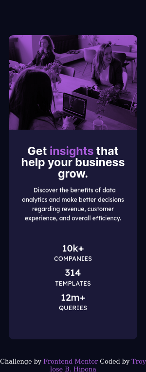

# Frontend Mentor - Stats preview card component solution

This is a solution to the [Stats preview card component challenge on Frontend Mentor](https://www.frontendmentor.io/challenges/stats-preview-card-component-8JqbgoU62). Frontend Mentor challenges help you improve your coding skills by building realistic projects. 

## Table of contents

- [Overview](#overview)
  - [The challenge](#the-challenge)
  - [Screenshot](#screenshot)
  - [Links](#links)
- [My process](#my-process)
  - [Built with](#built-with)
  - [What I learned](#what-i-learned)
  - [Useful resources](#useful-resources)
- [Author](#author)

## Overview

This project will help you to practice your CSS skills including responsive design.

### The challenge

Users should be able to:

- View the optimal layout depending on their device's screen size

### Screenshot

###
-Desktop View

![]

(./design/screenshot_desktop.png)

-Mobile View



### Links

- Solution URL: [Add solution URL here](https://your-solution-url.com)
- Live Site URL: [Add live site URL here](https://your-live-site-url.com)

## My process
  First I design this project as mobile-first approach and use semantic design
### Built with

- Semantic HTML5 markup
- CSS custom properties
- Flexbox
- Mobile-first workflow

### What I learned

I learn about a css propertice which is mix-blend-mode that sets how an element's content should blend with the content of the element's parent and the element's background.

To see how you can add code snippets, see below:


```css
img {
    max-width: 100%;
    mix-blend-mode: multiply;
}

figure {
    background-color: hsl(277, 64%, 61%); 
    border-radius: 12px  12px 0px 0px;  
    height: 15.15em;
}

### Useful resources

- [MDN](https://developer.mozilla.org/en-US/docs/Web/CSS/mix-blend-mode) - This helped me that here some property which is mix-blend-mode that you can mix an image and a background-color.

## Author

- Frontend Mentor - [@troytitoyjose@gmail.com](https://www.frontendmentor.io/home)
- Twitter - [@troytitoyjos@gmail.com](https://github.com/troy03)


